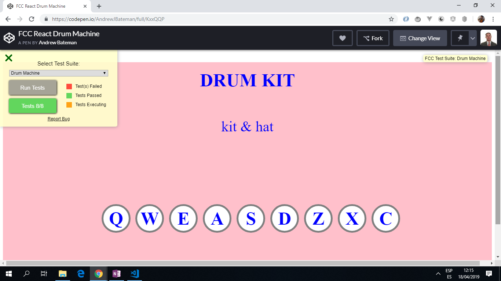

# React Drum Machine

App to create a simple drum machine using React. This was an objective for FreeCodeCamp.

*** Note: to open web links in a new window use: _ctrl+click on link_**

## Table of contents

* [General info](#general-info)
* [Screenshots](#screenshots)
* [Technologies](#technologies)
* [Setup](#setup)
* [Features](#features)
* [Status](#status)
* [Inspiration](#inspiration)
* [Contact](#contact)

## General info

**FCC Objective:** Build a CodePen.io app using HTML, JavaScript, SCSS and React.

* Codepen link: <https://codepen.io/AndrewJBateman/pen/KxxQQP?editors=0010>

**Requirements:**

* _User Story #1:_ I should be able to see an outer container with a corresponding id="drum-machine" that contains all other elements.

* _User Story #2:_ Within #drum-machine I can see an element with a corresponding id="display".

* _User Story #3:_ Within #drum-machine I can see 9 clickable drum pad elements, each with a class name of drum-pad, a unique id that describes the audio clip the drum pad will be set up to trigger, and an inner text that corresponds to one of the following keys on the keyboard: Q, W, E, A, S, D, Z, X, C. The drum pads MUST be in this order.

* _User Story #4:_ Within each .drum-pad, there should be an HTML5 audio element which has a src attribute pointing to an audio clip, a class name of clip, and an id corresponding to the inner text of its parent .drum-pad (e.g. id="Q", id="W", id="E" etc.).

* _User Story #5:_ When I click on a .drum-pad element, the audio clip contained in its child audio element should be triggered.

* _User Story #6:_ When I press the trigger key associated with each .drum-pad, the audio clip contained in its child audio element should be triggered (e.g. pressing the Q key should trigger the drum pad which contains the string "Q", pressing the W key should trigger the drum pad which contains the string "W", etc.).

* _User Story #7:_ When a .drum-pad is triggered, a string describing the associated audio clip is displayed as the inner text of the #display element (each string must be unique).

## Screenshots

.

## Technologies

* [React v16.4.0](https://reactjs.org/) Javascript library.

## Setup

This code was created in Codepen so it does not have an npm config json file. It will run in Codepen.

## Code Examples

* extract of `class DrumPad`

```javascript
  //method to handle a key down event from keyboard - play HTML audio and change display
  //no need to state actual keyCode
  handleKeyDown = event => {
    if(event.keyCode === this.props.padLetter.charCodeAt()) {
      this.audio.play()
      this.audio.currentTime = 0 //set time audio should play at (0 seconds)
      this.props.handleDisplay(this.props.id)
    }
  }

```

## Features

* uses an array of drumAudio elements that are accessed later.

```javascript
const drumAudio = [ //9 drum elements with src attribute for audio element
  { id: 'kit & hat', padLetter: 'Q', keyCode: 81, src: 'https://s3.amazonaws.com/freecodecamp/drums/Kick_n_Hat.mp3', type: 'audio/mp3' },
  { id: 'Bld H1', padLetter: 'W', keyCode: 87, src: 'https://s3.amazonaws.com/freecodecamp/drums/Bld_H1.mp3', type: 'audio/mp3' },
  { id: 'Dry Ohh', padLetter: 'E', keyCode: 69, src: 'https://s3.amazonaws.com/freecodecamp/drums/Dry_Ohh.mp3', type: 'audio/mp3' },
  { id: 'Punchy Kick', padLetter: 'A', keyCode: 65, src: 'https://s3.amazonaws.com/freecodecamp/drums/punchy_kick_1.mp3', type: 'audio/mp3' },
  { id: 'Side Stick', padLetter: 'S', keyCode: 83, src: 'https://s3.amazonaws.com/freecodecamp/drums/side_stick_1.mp3', type: 'audio/mp3' },
  { id: 'Heater 1', padLetter: 'D', keyCode: 68, src: 'https://s3.amazonaws.com/freecodecamp/drums/Heater-1.mp3', type: 'audio/mp3' },
  { id: 'Brk Snr', padLetter: 'Z', keyCode: 90, src: 'https://s3.amazonaws.com/freecodecamp/drums/Brk_Snr.mp3', type: 'audio/mp3' },
  { id: 'Heater 2', padLetter: 'X', keyCode: 88, src: 'https://s3.amazonaws.com/freecodecamp/drums/Heater-2.mp3', type: 'audio/mp3' },
  { id: 'Heater 3', padLetter: 'C', keyCode: 67, src: 'https://s3.amazonaws.com/freecodecamp/drums/Heater-3.mp3', type: 'audio/mp3' },
]

```

## Status & To-Do List

* Status: Tested and 100% working.

## Inspiration

* [Front End Libraries Projects - Build a Drum Machine](https://learn.freecodecamp.org/front-end-libraries/front-end-libraries-projects/build-a-drum-machine)
* [Drum Machine React Tutorial - Part 1](https://www.youtube.com/watch?v=nBF6dFjb7p0)
* [Drum Machine React Tutorial - Part 2](https://www.youtube.com/watch?v=QXX4aI9DOVE)
* [Drum Machine React Tutorial - Part 3](https://www.youtube.com/watch?v=Sqb5oMIa4yo)
* [Drum Machine React Tutorial - Part 4](https://www.youtube.com/watch?v=ESSQykjKmuA&t=112s)

## Contact

Created by [ABateman](https://www.andrewbateman.org) - feel free to contact me!
